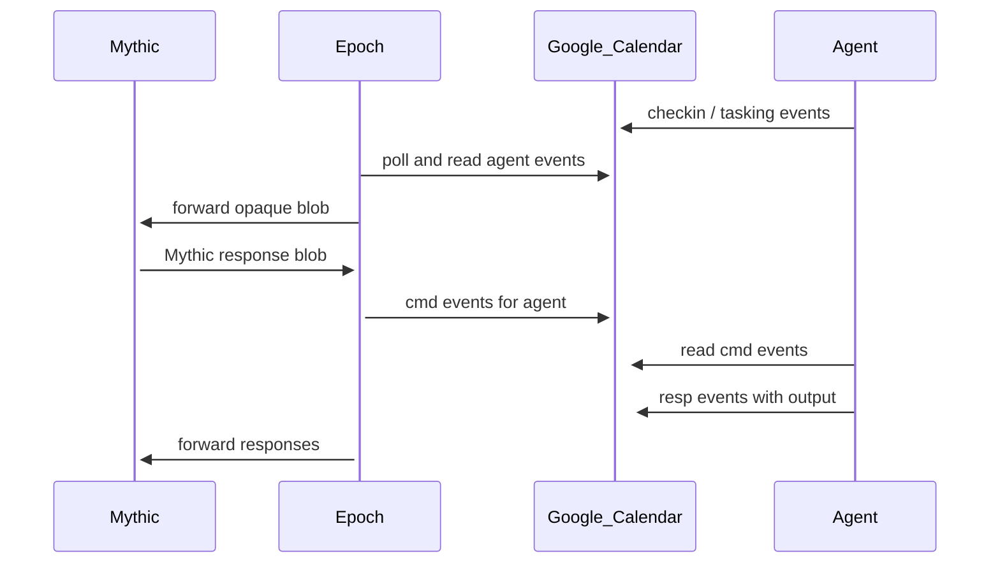

+++
title = "epoch"
chapter = false
weight = 5
+++

## Table of Contents

1. [Overview](#overview)
2. [Setup](#setup)
3. [Mythic configuration](#mythic-configuration)
4. [Protocol V2](#protocol-v2)
5. [OPSEC](#opsec)
6. [Development](#development)

## Overview

**Epoch** is a Mythic C2 profile — a **relay** between Mythic and **Google Calendar**. It creates, reads, and deletes calendar events that carry agent traffic between Mythic and implants on the target.

Agents using this transport (the reference implementation is **[Chronos](https://github.com/0xNirvana/chronos)**) only need outbound access to `googleapis.com`. There is no direct agent-to-Mythic connection on the network.

Install **[Chronos](https://github.com/0xNirvana/chronos)** for a working chain. `PROTO_VERSION = "2"` must match across Epoch and Chronos releases.

**Good for:** lifeline / re-entry beacons, low-and-slow async tasking, long dwell with minimal sustained noise.

**Not for:** sub-second interactive shells, large file exfil, or environments with no viable Google Calendar API path.

### Workflow



## Setup

### 1. Google Cloud project

1. Open [Google Cloud Console](https://console.cloud.google.com/)
2. Create or select a lab project
3. **APIs & Services → Library** → enable **Google Calendar API**

### 2. Service account and JSON key

1. **APIs & Services → Credentials → Create credentials → Service account**
2. Add a JSON key and save the file privately (never commit it)
3. Note the service account email: `your-sa@PROJECT.iam.gserviceaccount.com`

If key creation fails with `iam.disableServiceAccountKeyCreation`, relax that org policy for your lab project or use a project where key creation is allowed.

### 3. Shared calendar

1. In [Google Calendar](https://calendar.google.com/), create a lab-only calendar
2. **Share with specific people** → add the service account email
3. Permission: **Make changes to events**
4. Copy the full **Calendar ID** (e.g. `xxx@group.calendar.google.com`)

### 4. Install Epoch on Mythic

From your Mythic directory:

```bash
cd ~/Mythic
sudo ./mythic-cli install github https://github.com/0xNirvana/epoch
# Local development:
# sudo ./mythic-cli install folder /path/to/public/epoch
sudo ./mythic-cli start epoch
```

Also install **[Chronos](https://github.com/0xNirvana/chronos)** before building payloads.

## Mythic configuration

1. Mythic UI → **Installed Services → C2 → epoch**
2. Create or edit instance **`default`**
3. Set parameters:

| Parameter | Description |
|-----------|-------------|
| `calendar_id` | Full shared calendar ID from Google Calendar settings |
| `credentials_file` | Service account JSON (upload in UI) |
| `poll_interval` | Server poll interval (seconds); labs: 10–15 |
| `callback_jitter` | Jitter % for agents at build time |
| `AESPSK` | `aes256_hmac` (recommended) or `none` for dev |
| `event_hmac_key` | Optional base64 32-byte HMAC for calendar events |
| `debug` | Verbose server logging |

4. **Save** — this stores settings in Mythic's database only.

**Runtime files** (`c2_code/config.json`, `c2_code/credentials.json`) are written when you **build a Chronos payload** (Epoch config check). Do not start the profile until after the first payload build if `calendar_id` is required at startup.

After changing calendar ID or credentials: **Stop → Start** Epoch, then **rebuild** Chronos.

## Protocol V2

Canonical spec for agents implementing the Epoch transport. Chronos ships a matching `protocol_v2.py`; keep them identical per release tag.

### Routing (`extendedProperties.private`)

| Key | Value |
|-----|--------|
| `proto_version` | `"2"` |
| `msg_type` | `checkin`, `tasking`, `cmd`, `resp` |
| `agent_id` | 36-char Mythic callback UUID |
| `message_id` | Unique ID per logical message |
| `seq` / `total` | Chunk index for multi-event messages |

### Payload packing

- Event **description**, **location**, and up to 20 `chunk_N` extended properties hold base64 payload data
- Single-event capacity: ~10.3 KB (`SINGLE_EVENT_CAPACITY` in `protocol_v2.py`)
- Optional **event HMAC** (`event_sig`) over all packed fields

### Message flow

| `msg_type` | Direction | Purpose |
|------------|-----------|---------|
| `checkin` | Agent → Epoch | Initial registration |
| `tasking` | Agent → Epoch | Request work |
| `cmd` | Epoch → Agent | Tasking / replies |
| `resp` | Agent → Epoch | Command output |

## OPSEC

- Traffic goes to `googleapis.com` (legitimate Calendar API)
- Use a dedicated lab calendar; mix with real events only in controlled exercises
- Poll intervals of 30–120s with jitter resemble normal sync patterns
- Latency is **30–120s+** per round trip — not HTTP-beacon speed
- One shared calendar supports roughly **10–20 agents** before quota pressure
- Epoch does not expose a public listener; no inbound webhook required

## Development

Server code: `C2_Profiles/epoch/c2_code/` (`server.py`, `protocol_v2.py`).

Run protocol tests locally:

```bash
python3 -m unittest discover -s tests -p "test_*.py" -v
```
